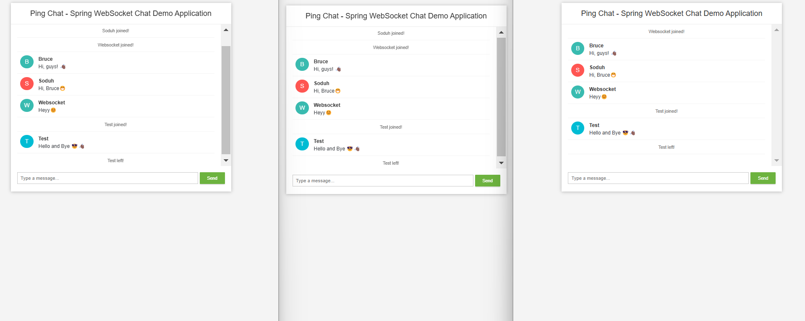
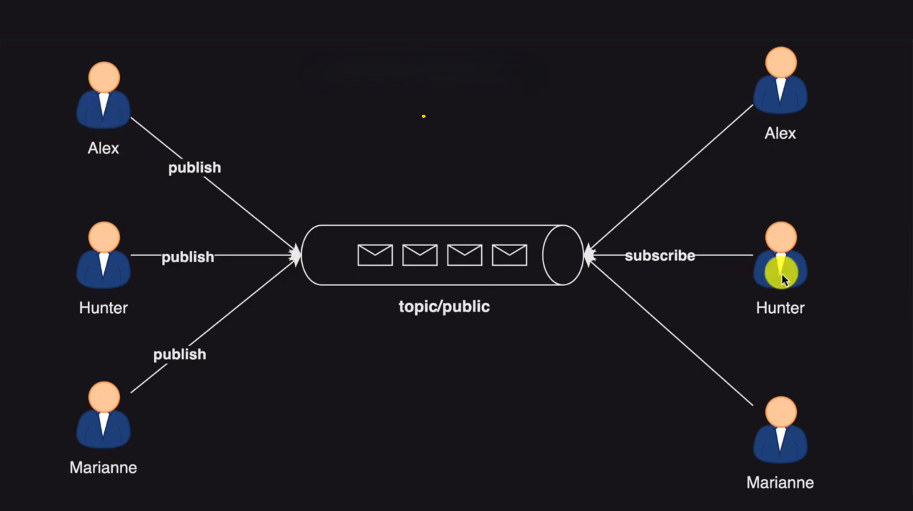

# ping-chat-websocket-app

Real time chat app using Web Sockets. 
It operates in a Group Chat setting.

### How to run

1. Clone repository

```bash
git clone git@github.com:bruce-mig/ping-chat-websocket-app.git
```

2. Start the application

```bash
cd ping-chat-websocket-app
sudo chmod +x mvnw
./mvnw spring-boot:run
```

3. The app is available at port 8080. Join group and enjoy a conversation with friends  ...



### System Design


